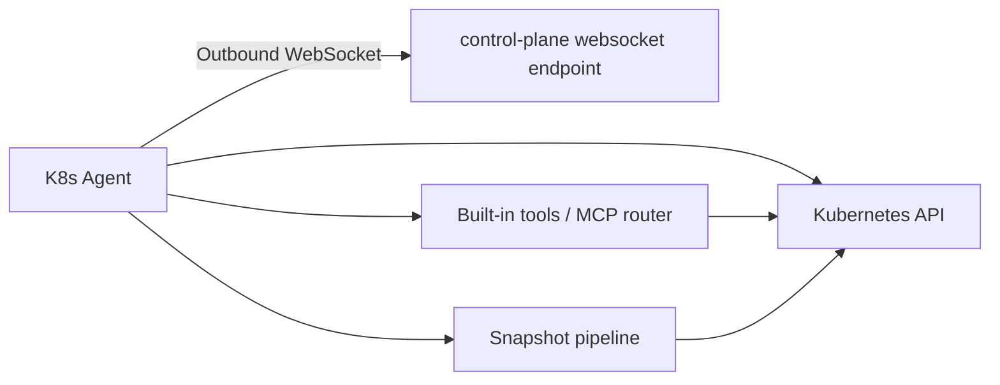
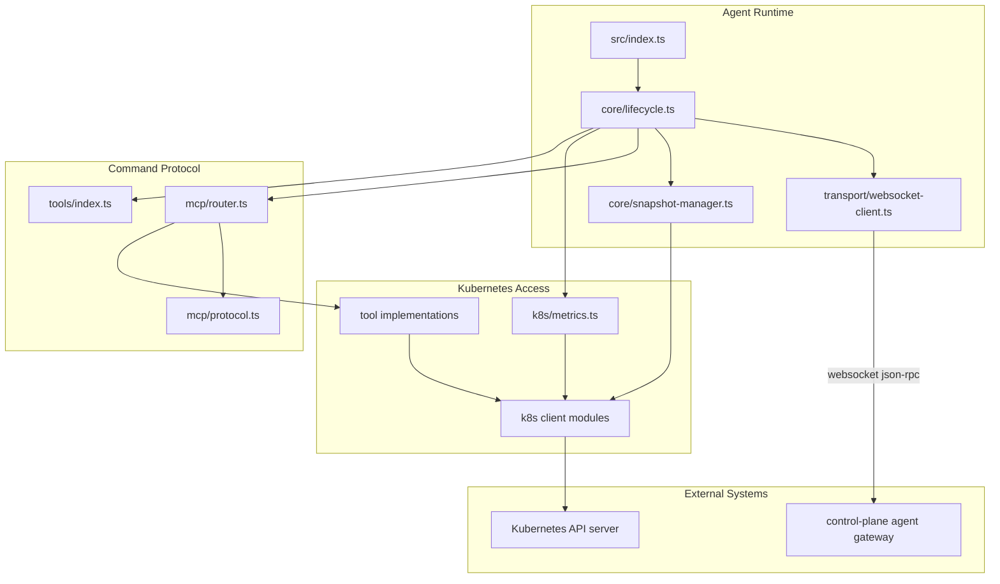

# K8s Agent Architecture

The cluster agent is the cluster-resident execution edge for:

1. outbound-only connectivity to the control plane
2. telemetry snapshot collection
3. JSON-RPC tool execution
4. heartbeat and lifecycle reporting
5. safe cluster interaction with read/write gating

## High-Level Diagram

## Detailed Diagram

## Primary Responsibilities

1. connect to the control plane using an outbound-only websocket client
2. perform handshake, heartbeat, reconnect, and readiness coordination
3. collect snapshots from cluster resources and metrics APIs
4. execute control-plane-issued JSON-RPC tool calls
5. keep local state minimal and recover through reconnect + re-handshake
